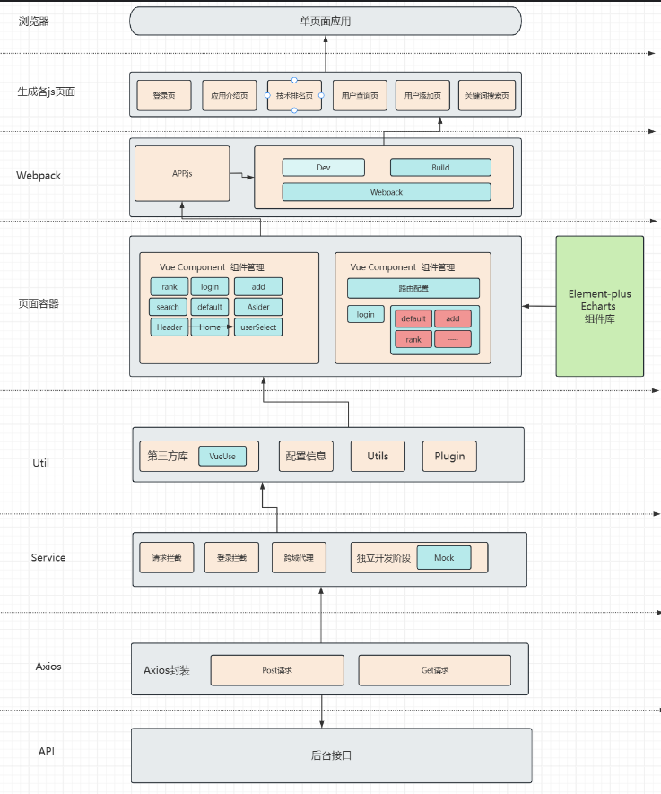
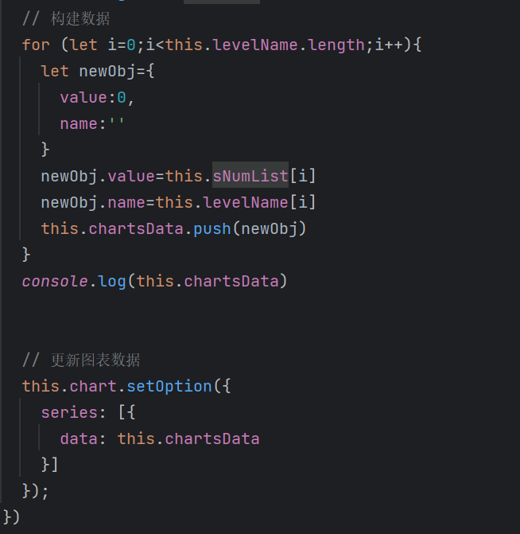
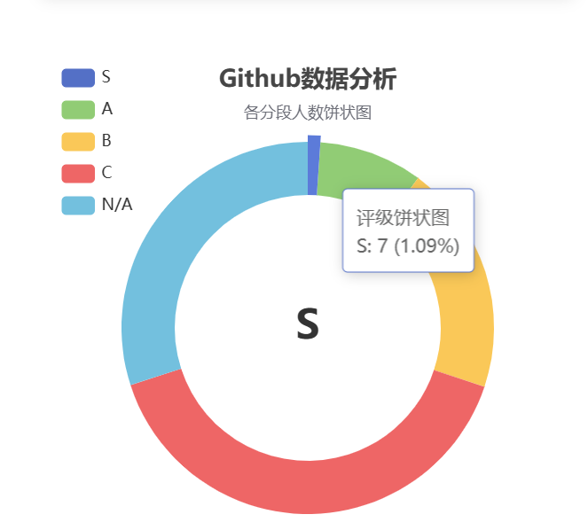
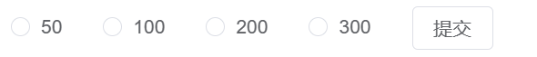

# 开发者技术评估-GitGuru（前端部分）
# 一、项目介绍
GitGuru一个分析评估Github上用户数据并具有一定搜索操作的应用，致力于为用户展示Github上各用户的个人信息，技术能力的数据分析。

前端使用了Vue3和Javascript语言开发，除了完成了对开发者的技术能力进行评估，对开发者Nation的预测，按照特定关键词进行搜索匹配的基础功能之外，GitGuru还提供了对用户进行添加，用户项目技术分析等特色功能，提高了功能的完备性。同时还引入了Echarts来对技术评分在饼状图上进行呈现，实现评分可视化。

后端部分：
- 登录校验：使用GitGuru的用户需要进行登录，若没有账号则可以进行注册。

- 加载github数据：在GitGuru刚启动后，需要从github请求一定量的数据，该数据的数量决定了之后用户技术等级评估的精确程度。

- 查找github用户（领域查找）：GitGuru支持用户提供关键词来查询数据库中的github用户，结果以用户技术等级降序排序。如.输入china则会显示所有与china有关的github用户。

- 添加指定github用户：若某用户未在GitGuru的数据库中，可以手动添加用户。

- 技术评估：GitGuru可以根据github用户的粉丝数量，github用户的项目重要程度（根据此人对该项目的贡献）等属性来进行技术评估。

- 猜测github用户nation：有些开发者没有在简介中写明其所属国家/地区，GitGuru可以通过其工作时间、社交关系来推断其所属nation。

- 开发者技术能力评估信息自动整理：GitGuru可以通过用户的自我介绍以及用户最重要的一些项目的readme文档来归纳整理出用户的技术能力，以及技术特点。

  > 注：以上所有猜测的数据，若置信度不高，则会返回N/A。

# 二、项目分工


| 团队成员   | 主要工作                                         |
| ---------- | ------------------------------------------------ |
| 万欣(队长) | 后端的架构设计、技术选型、具体接口实现、接口测试 |
| 黎汝星     | 前端开发，包括前端架构设计、前端业务模块实现等   |

# 三、功能演示

## 3.1 整体演示
- 利用Xxl-Job定时更新用户技术得分：https://www.bilibili.com/video/BV1HoDSY1EBR/?vd_source=028657a849e866c70dc5d4bc19b98741
- GitGuru前端展示部分：https://www.bilibili.com/video/BV1wdDSYjEVB/?vd_source=87f3da7c5a6a611dc4cd4f324df29ee8
## 3.2 功能模块演示
### 3.2.1 用户登录注册
- 当用户输入登录信息后点击登录按钮，系统将与数据库中登录的用户信息对比，进行验证。
- 如果用户未注册过，系统将提供一个注册面板，以便用户可以完成注册，随后，用户可以使用其新创建的账户进行登录操作。
### 3.2.2 首页介绍与流量限制
- 首页中介绍了本应用的几个功能，包括技术排名，用户查询，用户添加，关键词搜索等
- 访问次数限制：在1h内访问Github次数为50，100，200，300
### 3.2.3 饼状图分析 
- 统计各个评级的人数进行展示
### 3.2.4 技术排名
- 技术排名，通过对用户的score进行档次划分，每次展示前10名的用户:
-- score>=358分为S
-- 110<=score<358为A
-- 34<=score<110为B
-- 15<=score<34为C
-- score<15为N/A
- 对用户的UserName，Nation，Field，Email，Github_url进行展示和介绍
### 3.2.5 地区预测
- 如果在显示的用户的Nation这一栏中为null，那么就可以进行预测
- 若返回结果为N/A，说明置信度不高，不可作为推断依据，如果置信度够高，那么将会返回预测的用户所在地，并给出推断理由
### 3.2.6 用户查询及用户作品分析
- 可以对用户的login进行查询，用户输入login后，匹配数据库中的login进行查询
- 若存在，会根据用户作品的Readme.md文件给出用户的作品分析
- 加入用户仓库数，gist数，和关注人的数的柱状图
### 3.2.7 添加用户
- 对Github上存在的用户但是未录入到本系统的数据库中的用户进行添加
### 3.2.8 关键词搜索
- 通过国家关键词可以显示同属于一个国家的用户
- 通过领域关键词可以显示同属于一个领域的用户

# 四、前端实现
## 4.1 技术选型
- 前端框架：Vue 3
- 路由管理：Vue Router
- 实用工具库：VueUse
- 编程语言：JavaScript
- UI库：Element-plus
- 前端构建工具：Vite
- 网络请求库：Axios
- 部分网络请求方式：XMLHttpRequest
- 模块打包工具：Webpack
- CSS预处理器：SCSS
- 包管理工具：npm
- 版本控制工具：Git
## 4.2 前端架构图



## 4.3 项目特色介绍

### 4.3.1 技术排名

- 从后台获取到用户的score，其中：score =粉丝数×w1＋仓库数×w2＋所有仓库的总得分，仓库得分= (Star数×w3 + fork数× w4 + lssue数× w5 +Watch数×w6)×仓库创建的时间戳*该用户对此仓库的贡献占比（贡献比例是轮询所有人的贡献分，再利用该用户的贡献分除总体贡献分等到贡献比例）

- 通过对每一个用户的score进行划分，得到用户对应的评级，从得分从高到低一页显示10名用户


### 4.3.2 地区预测

Kimi是北京月之暗面科技有限于2023年10月9日推出的一款智能助手，主要应用场景为专业学术论文的翻译和理解、辅助分析法律问题、快速理解API开发文档等，是全球首个支持输入20万汉字的智能助手产品。

获取的用户信息中，有些用户的loaction是null的，系统引入Kimi来推断，用预测

具体实现思路：

- 从GitHub用户的event中，得到用户的工作时间，而获取的工作时间在一定程度上可以得到其时区信息。
- 从GitHub用户关注的人和粉丝中，轮询得到其所有出现的location，该数据里可以获得GitHub用户一定的nation信息。
- 从用户的昵称入手，用户的昵称一般都是使用其本国语言，可以从中获得一定的信息。

具体效果

- 若预测成功，系统会给出推断理由以及推断结果
- 若置信度不高，系统会返回N/A以及对应提示信息

### 4.3.3 数据（饼状图）统计

获得每个评级的用户数量，并引入Echarts中的饼状图进行分析，同时可以对这一功能进行扩展，包括对来自于同一个国家的用户数量，属于同一技术领域，如Ruby，CSS等的用户数量，关注同一个用户的用户数量等等。




    // 创建一个 ECharts 实例
    this.chart = echarts.init(this.$refs.chart)
    // 在 ECharts 实例中配置图表
    this.chart.setOption(this.getOption())
    // 获取各分段人数并更新
    getEchartsData().then(res=>{
      if (res.code===200){
        console.log(res.data)
        this.chartData=res.data
      }
      this.sNumList.push(this.chartData.sSize)
      this.sNumList.push(this.chartData.aSize)
      this.sNumList.push(this.chartData.bSize)
      this.sNumList.push(this.chartData.cSize)
      this.sNumList.push(this.chartData.dSize)
      console.log(this.sNumList)
      // 构建数据
      for (let i=0;i<this.levelName.length;i++){
        let newObj={
          value:0,
          name:''
        }
        newObj.value=this.sNumList[i]
        newObj.name=this.levelName[i]
        this.chartsData.push(newObj)
      }
      console.log(this.chartsData)


      // 更新图表数据
      this.chart.setOption({
        series: [{
          data: this.chartsData
        }]
      });

Echarts配置：


    // 处理饼状图数据
    getOption(){
      return {
        // 这里是你的 ECharts 配置项
        title: {
          text: 'Github数据分析',
          subtext: '各分段人数饼状图',
          left: 'center'
        },
        tooltip: {
          trigger: 'item',
          formatter: '{a} <br/>{b}: {c} ({d}%)'
        },
        legend: {
          orient: 'vertical',
          left: 10,
          data: ['S', 'A', 'B', 'C', 'N/A']
        },
        series: [
          {
            name: '评级饼状图',
            type: 'pie',
            radius: ['50%', '70%'],
            avoidLabelOverlap: false,
            label: {
              show: false,
              position: 'center'
            },
            emphasis: {
              label: {
                show: true,
                fontSize: '30',
                fontWeight: 'bold'
              }
            },
            labelLine: {
              show: false
            },
            data: [
              {value: 1312, name: 'S'},
              {value: 55, name: 'A'},
              {value: 54, name: 'B'},
              {value: 555, name: 'C'},
              {value: 111, name: 'N/A'}
            ]
          }
        ]
      }
    }


### 4.3.4 流量限制

由于Github上，1h的访问此数为5000次，所以在初次对数据进行获取的时候，要预留一部分给后续功能来访问，所以系统设置了50，100，200，300的访问量，并用定时器在1h后恢复对Github访问权限



### 4.3.5 进度条实现

由于在用户查询及分析的时候的时候，系统是通过login来获取用户技术信息，其具体实现思路：

- 有一些GitHub用户在个人信息中有本身账号的相关介绍，我们可以提取出其信息。
- 从GitHub用户技术含量最高的五个项目入手。提取其README文件（注意：从GitHub API得到的README信息是通过base64编码的，所有需要进行解码）。

通过上述得到的信息，将其输入给Kimi，让其整理出该用户的技术特点，所以这样一系列的操作会有time<1min的延迟，为了解决用户的体验感，系统在等待kimi分析的时候加入了一个进度条，这个进度条能够让用户知道，系统正在获取数据，并且在进度条未跑满时，而此时数据已经获取到，系统会加速进度条使在数据显示前进度条加载完成。

具体实现：

- 设置InfoFlag，判断是否获取到数据`InfoFlag:0`
- 设置循环执行定时器setInterval来不间断的增长进度条长度，当获取到数据而进度还没有增长到最大值时，此时直接令width=最大长度，会让进度条直接到顶端。这样带来的视觉体验较为流程。在其中，还调整间隔时间为0.01s,步长为0.02px补帧使进度条流畅


    predictByInput(){
      console.log(this.params)
      this.progress = 0;
      // 在这里设置一个异步的进度条setInterval，随着请求的时间，先按步长2来每秒增加进度条，如果请求到了数据，即请求标志位为1了，直接拉满
      this.startProgressBar();
      selectByName(this.params).then(res=>{
        if (res.code===200) {
          this.InfoFlag=1
          this.stopProgressBar();
          console.log(res.data)
          this.text=res.data
          // this.changeRow()
        }
      }).catch(error => {
        this.stopProgressBar();
        // 处理错误
      });
    },
    startProgressBar() {
      this.timer = setInterval(() => {
        if (this.progress < 100) {
          if (this.InfoFlag===1){
            console.log(this.InfoFlag)
            this.progress=100
          }
          this.progress += 0.02; // 这里简单地每秒增加10%的进度
        } else if(this.InfoFlag===1){
          this.stopProgressBar();
        }
      }, 10); // 每0.01秒更新一次进度
    },
    stopProgressBar() {
      clearInterval(this.timer);
      if (this.InfoFlag===1){
        this.progress=0
      }
      this.InfoFlag=0 // 重置
      //this.progress = 100; // 确保进度条达到100%
    },


# 五、项目结构

```
├─assets
│  └─iconfont              // 阿里矢量图标库
│      └─icon
├─components               // 组件
│  └─Asider.vue            // 侧边栏 
│  └─Header.vue            // 标题栏
│  └─Home.vue              // 容器栏
│  └─login.vue             // 登录界面
│  └─content               // 内容组件
│      └─add.vue           // 添加页面
│      └─defalut.vue       // 默认页面
│      └─rank.vue          // 技术排名页面（预测，饼状图）
│      └─search.vue        // 关键词（地区，领域）查询
│      └─userSelect.vue    // 用户查询及项目分析
│  
├─request                  // axios封装
│  └─api.js                // 各种接口函数
│  └─index.js              // axios配置
├─router                   // 路由
│  └─index.js              // 路由设置
├─APP.vue                  // 入口
├─main.js                  
```
# 三、运行方式
- npm install
- npm run build
- npm run serve
